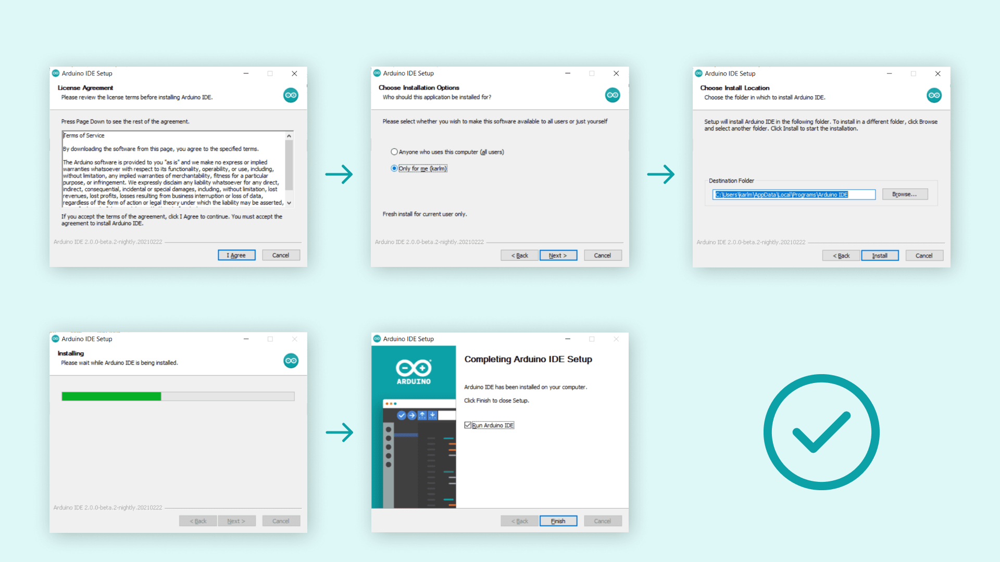
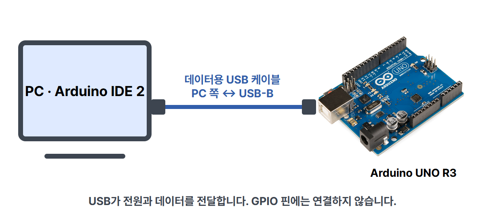
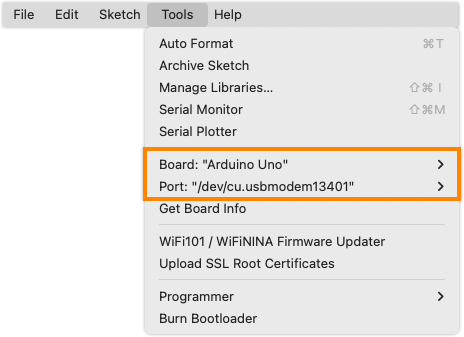

# Arduino UNO · IDE부터 첫 실행까지

Arduino IDE는 보드에 무엇을 할지 코드로 적고, 그 코드를 보드에 보내는 프로그램입니다.

카드뉴스는 IDE의 역할과 연결·실행 결과를 쉽게 설명합니다. 이 글에서는 설치와 클릭 순서를 화면별로 따라갑니다. UNO R3, Windows 10 이상 64비트 기준입니다. 아래 캡처는 Arduino 공식 문서의 참고 화면이며 이 PC에서 실습을 실행한 사진은 아닙니다. 화면 자료는 IDE 2 계열이고, 설치한 버전에 따라 모양과 위치가 다를 수 있습니다. 카드에서는 제품명을 Arduino IDE로 표기합니다.

## 1. 프로그램 설치하기

[Arduino 공식 Software 페이지](https://www.arduino.cc/en/software)에서 PC에 맞는 Arduino IDE 설치 파일을 받습니다. Windows에서는 설치 파일을 실행합니다.

왼쪽 위부터 순서대로 진행합니다.

1. License Agreement: 약관을 읽고 동의하는 경우 I Agree를 선택합니다.
2. Choose Installation Options: 사용할 계정을 선택하고 Next를 누릅니다.
3. Choose Install Location: 설치 위치를 확인하고 Install을 누릅니다.
4. 설치가 끝나면 Finish를 눌러 Arduino IDE를 엽니다.

설치 화면은 공식 문서의 이전 버전 참고 자료입니다. 현재 다운로드의 설치 옵션과 문구가 다르면 해당 설치 프로그램의 안내를 따르세요.

## 2. USB로 UNO 연결하기

준비물은 UNO R3, 데이터용 USB-B 케이블, PC입니다. PC 쪽 단자는 USB-A 또는 PC에 맞는 단자를 사용합니다. 충전만 되는 케이블은 보드를 찾지 못할 수 있습니다.

PC와 UNO의 USB-B 단자를 연결합니다. 이번 예제에서는 USB가 전원도 공급하므로 센서·점퍼선·별도 전원은 필요하지 않습니다.

## 3. 보드와 포트 선택하기

1. 상단 Tools(도구) > Board(보드) > Arduino AVR Boards > Arduino Uno를 선택합니다. UNO R3에 맞는 보드이며 UNO R4는 선택하지 않습니다.
2. Arduino AVR Boards가 없으면 Boards Manager(보드 매니저)에서 해당 패키지를 설치합니다.
3. Tools > Port(포트)에서 연결한 UNO의 실제 COM 포트를 선택합니다. 연결 전후에 새로 나타나는 포트를 비교하면 찾기 쉽습니다.

위 화면은 macOS 참고 화면이라 포트 이름이 /dev/cu...로 보입니다. Windows에서는 COM 뒤에 숫자가 붙습니다. 다른 사람의 포트 번호를 그대로 고르지 마세요.

보드 이름은 코드가 어느 보드용인지 정하고, 포트는 PC가 어느 보드에 코드를 보낼지 정합니다. 두 항목을 각각 확인합니다. 보드 이름을 선택했다고 USB 연결까지 완료된 것은 아닙니다.

## 4. 예제 파일 열기

이 저장소의 [sketch.ino](sketch.ino)를 내려받아 Arduino IDE에서 엽니다. IDE가 sketch라는 폴더 생성을 요청하면 허용합니다. 코드를 새 창에 복사해 저장해도 됩니다.

setup()은 시작할 때 LED 출력과 시리얼 통신을 설정합니다. loop()는 LED 켜기 → 문장 보내기 → 1초 기다리기 → LED 끄기 → 1초 기다리기를 반복합니다. 외부 라이브러리는 필요하지 않습니다.

## 5. 검증한 뒤 업로드하기

- 왼쪽 체크 표시 Verify(검증): 코드의 오류를 확인하고 컴파일합니다.
- 오른쪽 화살표 Upload(업로드): 코드를 컴파일하고 선택한 보드로 보냅니다.

먼저 체크 표시를 누르고, 오류가 없으면 오른쪽 화살표를 누릅니다. 완료 메시지를 확인합니다. 오류가 나오면 아래 로그에서 이유를 확인하고 보드·포트·케이블부터 점검합니다. 업로드 중에는 USB를 빼지 마세요.

## 6. 불빛과 문장으로 실행 확인하기

1. 보드의 L LED를 봅니다. 약 1초 켜지고 1초 꺼지면 예제가 실행 중입니다.
2. Serial Monitor(시리얼 모니터)를 엽니다. 보드가 보낸 글을 보는 창입니다.
3. 속도를 9600 baud로 맞춥니다. 코드의 Serial.begin(9600)과 같아야 합니다.
4. 이번 코드에서는 UNO READY가 약 2초마다 한 줄씩 나옵니다.

위 참고 화면의 Hello World!는 Arduino 공식 예제의 출력입니다. 이 저장소의 예상 출력은 아래와 같습니다. 실제 실행 캡처를 대신한 그림이 아닙니다.

~~~text
UNO READY
UNO READY
UNO READY
~~~

## 막혔을 때

| 증상 | 먼저 확인할 것 |
| --- | --- |
| 포트가 안 보임 | 데이터용 USB 케이블인지 확인하고 다른 USB 포트에 연결 |
| Unknown으로 표시됨 | Arduino Uno와 연결한 포트를 직접 선택 |
| 보드 목록에 Uno가 없음 | Arduino AVR Boards 패키지 설치 |
| 업로드 오류 | 보드·포트 설정 확인, 다른 프로그램의 시리얼 연결 닫기 |
| 시리얼 글자가 깨짐 | 모니터 속도를 9600 baud로 맞추기 |

호환 보드의 USB 드라이버는 해당 보드 제조사 안내를 확인합니다. 메뉴 위치가 다르면 [공식 보드·포트 선택 안내](https://support.arduino.cc/hc/en-us/articles/4406856349970-Select-board-and-port-in-Arduino-IDE)를 참고하세요.

## 검증 범위

공식 자료와 보드·포트·버튼 순서, 코드에 따른 LED·시리얼 결과를 검수했습니다. 실제 UNO 업로드, 펌웨어 컴파일과 하드웨어 실행은 수행하지 않았습니다. 화면들은 공식 참고 자료입니다. diagram.json은 내장 LED 예제용 UNO만 배치했으며 USB를 GPIO 배선으로 표시하지 않습니다.

## 화면 출처와 사용 조건

공식 화면을 수정하지 않고 표시했습니다. 설명 글은 CODEPLANT가 작성했습니다.

| 파일 | 출처 |
| --- | --- |
| ide-install-screen.png | Arduino Documentation / Karl Söderby · IDE 설치 문서의 downloading-and-installing-img02.png |
| ide-tools-screen.png | Arduino Help Center · 보드와 포트 선택의 Tools 메뉴 화면 |
| ide-uno-port-screen.png | Arduino Help Center · UNO가 선택된 보드 표시 |
| ide-buttons-screen.png | Arduino Documentation / Karl Söderby, Jacob Hylén · 업로드 문서의 uploading-a-sketch-img01.png |
| ide-serial-screen.png 및 ide2-screen.png | Arduino Documentation / Karl Söderby · 시리얼 모니터 문서 |
| uno-r3-photo.jpg | SparkFun / Wikimedia Commons · CC BY 2.0 |

- 설치 문서: https://docs.arduino.cc/software/ide-v2/tutorials/getting-started/ide-v2-downloading-and-installing/
- 업로드 문서: https://docs.arduino.cc/software/ide-v2/tutorials/getting-started/ide-v2-uploading-a-sketch/
- 시리얼 문서: https://docs.arduino.cc/software/ide-v2/tutorials/ide-v2-serial-monitor/
- Tools 화면 원본: https://support.arduino.cc/hc/article_attachments/6366428819228
- UNO 선택 화면 원본: https://support.arduino.cc/hc/article_attachments/6366428795164
- Documentation 라이선스: https://github.com/arduino/docs-content/blob/main/LICENSE.md
- Help Center 라이선스: https://github.com/arduino/help-center-content/blob/main/LICENSE.md
- UNO 사진 원본: https://commons.wikimedia.org/wiki/File:Arduino_Uno_-_R3.jpg
- CODEPLANT 유튜브: https://www.youtube.com/@codeplant2024

이 안내문과 Documentation 참고 화면 및 이를 포함한 표지 카드는 [CC BY-SA 4.0](https://creativecommons.org/licenses/by-sa/4.0/)으로 제공합니다. Help Center 화면은 원본 저장소의 라이선스를 따르며, UNO 사진은 [CC BY 2.0](https://creativecommons.org/licenses/by/2.0/)입니다. 상표와 공식 로고의 권리는 각 소유자에게 있습니다.

자료 확인: 2026-10-05. 카테고리: 기본 세팅 · 파랑. 다음 편: 신호처리.
